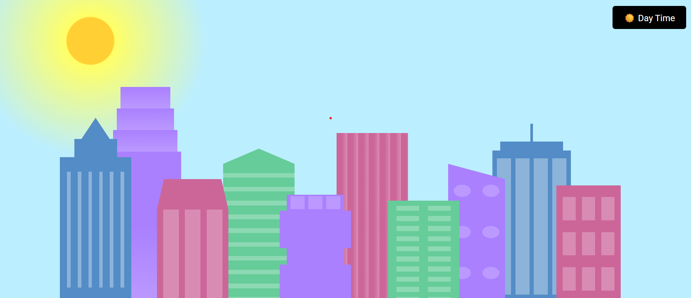
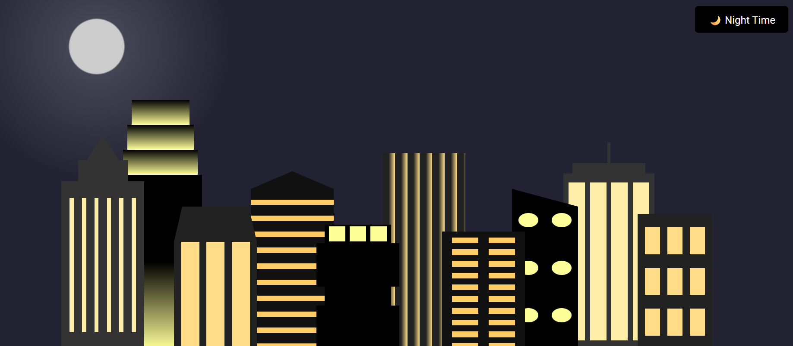

# day-night-city-skyline
A modern city skyline that can be changed between day / night. This was made completely out of HTML, CSS & Javascript.

The display has a day / night toggle button which can be used to change the time of day. With this change, the image will adapt to the time.

